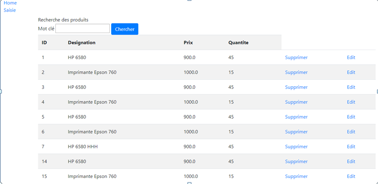
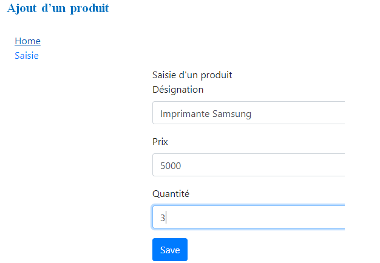
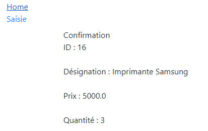
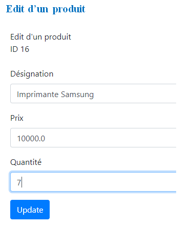
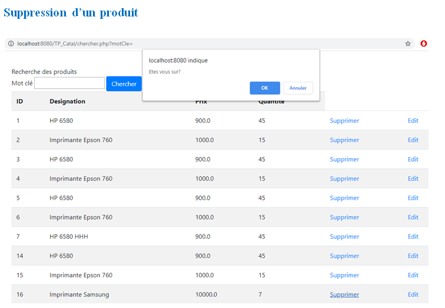

# Catalogue-Products
Dev JEE Servlet JSP JSTL  MVC BootStrap  JDBC ORM MYSQL

Extract the file Catalogue-Products.rar, open the project with Eclipse IDE for Enterprise Java Developers and run it.

